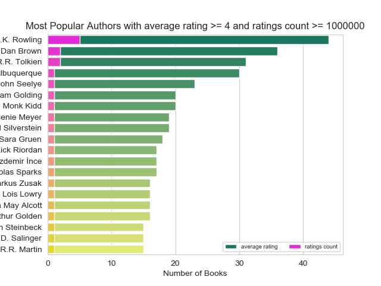

# viz-homework

Greatest figure that helps me to interpret my data is

because it shows most popular first 20 authors with their corresponding book numbers satisfying ratings count >=1000000 and average rating >=4 in descending order separately. Here, we can extract information about how an author's total number of books satisfying certain conditions correlated with his/her popularity (ratings count) and his/her books quality (average rating). For instance, J. K. Rowling has high quality >40 books and very popular 5 books. Dan Brown, who is the second author in the list, has almost 35 high quality books together with 2 very popular ones. Numbers of book that are high quality and very popular are highly correlated, which indicates as the number of books decrease in one of them results in decrease for the other one. 

Other figures, for instance, one of them explores the relation between pages number, average rating and ratings count, which provides no useful information since the pages number has no clear effect on average rating and rating count. The other figure indicates the effect of language of the books on average rating and ratings count, and similarly shows no explicit relation in the sense of connecting average rating and ratings count since almost all of these books were written english.    
